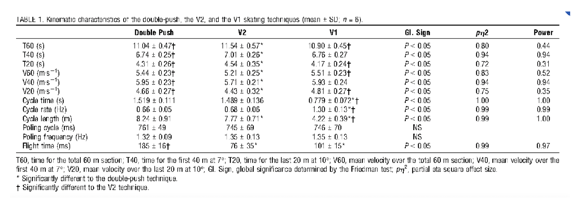

# Ski Technique Calculator

This repository contains code and analysis for optimizing cross-country skiing technique selection based on course profile and efficiency data.

## Overview

The ski technique calculator analyzes v1/v2 speed ratios at varying inclines using Linear Regression to determine the optimal technique for different sections of a race course. The model helps predict which technique (v1, v2, or v2-alt for downhill) is most efficient at each point on the course.

## Features

- Extrapolates v1/v2 speed ratios at varying inclines using Linear Regression
- Classifies race-course sections into "v1" or "v2" (or v2-alt for downhill/turning techniques) based on v1-incline, v2-incline efficiency graphs
- Calculates total race time given v1-v2/slope efficiency graphs
- Visualizes race course with color-coded technique sections (Red: v2, Blue: v1, Orange: v2-alt)

## Visualizations

### Speed Efficiency Graphs

The following image shows the race course visualization with optimal technique selection:


### Speed Analysis

Speed analysis showing the relationship between techniques and elevation:



## Technical Details

The calculator uses mathematical models to:
1. Create efficiency graphs automatically based on data
2. Apply Linear Regression to predict optimal technique based on slope
3. Calculate time on course using a line integral approach
4. Add perturbation analysis to identify weak points in technique that could be training focuses

## Usage

The code is written in Wolfram Language (.wl) and can be executed in Mathematica or other Wolfram environments. The main file is `src/technique_calculator.wl`.

```
(* Example of how to run the analysis *)
<< "src/technique_calculator.wl"
```

## Applications

- Race strategy planning
- Training focus identification
- Technique optimization for specific courses
- Performance prediction based on technique selection
